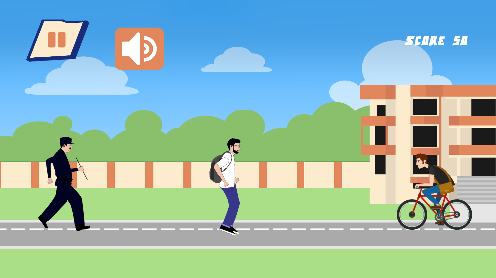

# **UOS Campus Runner**

UOS Campus Runner is a Mobile 2D Game that lets you play or run a character across an
environment for score collecting and completing the level.

I developed this project as my Final year Project for Bachelor of Science in Information Technology.

## Basic Architecture
---
**Main Character :** A Graphical represented running character which is control through using of touch sensitive control. Player can jump, slide the character on his desire action.

**AI Character :** A Graphical represented AI Main running character which perform actions against player’s action . this character control by the system using AI.

**Envoirment :** A Graphical representation of all over the game which has a track on which Player’s character is running . Player’s will jump and slide over the barriers and collect points. 

## Objectives
---
- The main Character which jump, slide through using touch controls.
- The main character will collect points.
- An AI character which run behind the main character for catching.
- In game’s environment, some barriers and interruptions (for characters jumping and sliding.)
- Option also available for Game’s setting like sound, quality etc. 

## Tools
---
- [Unity](https://unity3d.com/get-unity/download) version 5.3.6p1 or Higher
- [Adobe Photoshop](https://www.adobe.com/products/photoshop.html) & [Adobe Illustrator](https://www.adobe.com/products/illustrator.html) for making graphical assets.
- C# programming language.
- MonoDevelop (IDE)

## Documentation
---
For Documentation, Contact me on youth.mirza@gmail.com

